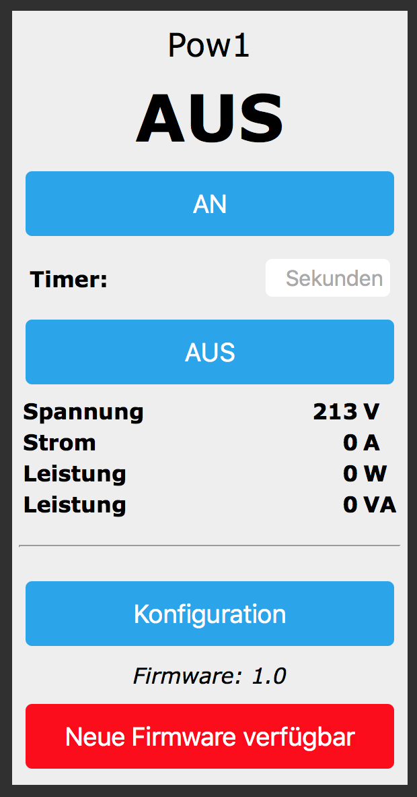
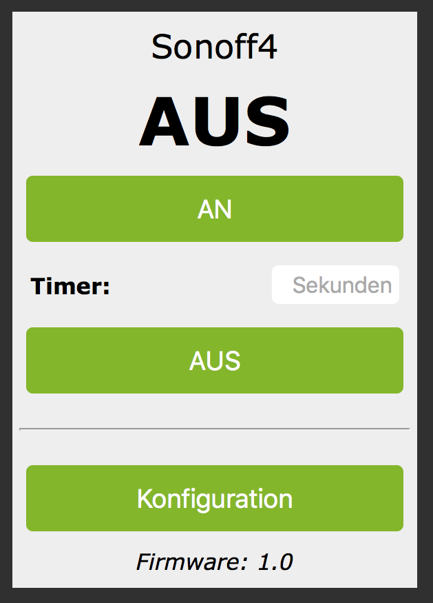

# SonoffHMLOX - DISCONTINUED - 

## Alternative Firmware für die Geräte Sonoff Switch, S20, SV, Touch, POW (nicht R2!) und der [OBI WiFi Steckdose](https://www.obi.de/hausfunksteuerung/wifi-stecker-schuko/p/2291706)

### Hinweis: Die Modifizierung des Sonoff (wenn auch nur softwareseitig) erfolgt auf eigene Gefahr! Während der Arbeiten/des Flash-Vorgangs am geöffneten Gerät darf keine Netzspannung (230V) anliegen!

Für Informationen zur Einrichtung etc., bitte das [Wiki](https://github.com/jp112sdl/SonoffHMLOX/wiki) benutzen.
Schaut euch auch das Youtube-Video [[Klick hier](https://www.youtube.com/watch?v=TBJMZC-YG_g)] auf "verdrahtet" an!

Unterstützung weiterer Modelle:
- eine Firmware für den Sonoff Dual / HVIO (als Schalt-Aktor) gibts [hier](https://github.com/jp112sdl/SonoffDualHVIOHMLOX) 
- eine Firmware für den Sonoff Dual / HVIO (als Rollladen-Aktor) gibts [hier](https://github.com/jp112sdl/SonoffDualShutterHMLOX) 
- eine Firmware für den Shelly 1 gibts [hier](https://github.com/jp112sdl/ShellyHMLOX/releases) (Einrichtungsanleitung wie bei Sonoffs, siehe Wiki)

Die neueste kompilierte Firmware, die direkt auf den Sonoff geflasht werden kann, findet ihr in den [Releases](https://github.com/jp112sdl/SonoffHMLOX/releases/latest).

Wenn sich bereits eine ältere Version der hier angebotenen Firmware auf dem Sonoff befindet, kann das Update "Over-the-Air", also direkt über das WLAN erfolgen! -> [Anleitung](https://github.com/jp112sdl/SonoffHMLOX/wiki/Flash_OTA)

 

